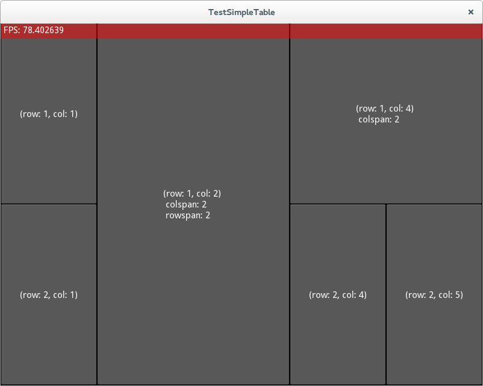

Simple Table Layout
===================

Simple Table like Layout that understands rowspan and colspan properties of children (like HTML tables).

Usage (kv):

Example 1:
    SimpleTableLayout:
        rows: 2
        cols: 2

        Button:
            text: "C1"
            colspan: 2
        Button:
            text: "C2"
        Button:
            text: "C3"

creates:
    
    ###########
    
    #    C1   #
    
    ###########
    
    # C2 # C3 #
    
    ###########

Example 2:
    
    SimpleTableLayout:
        rows: 2
        cols: 2

        Button:
            text: "C1"
            rowspan: 2
        Button:
            text: "C2"
        Button:
            text: "C3"

creates:
    
    ###########
    
    #    # C2 #
    
    # C1 ######
    
    #    # C3 #
    
    ###########

Lastly, SimpleTableLayout.cell(row, col) returns widget at that position in the grid.

License
=======
MIT license.

Credits
=======
Author: Jeyson Molina <jeyson.mco@gmail.com>
